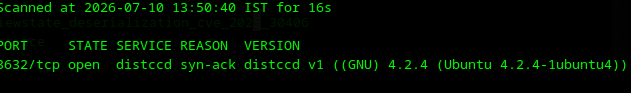

# Port 3632 Enumeration - DistCC

## Target Information

- **Target IP:** `192.168.91.138`
- **Port:** `3632/tcp`
- **Service:** DistCC
- **Host:** Metasploitable 2

---

# Objective

Identify the service running on TCP port 3632 and determine whether it is vulnerable.

---

# Initial Port Scan

A RustScan scan was performed against the target.

### Command

```bash
rustscan -a 192.168.91.138 -p 3632 -- -A
```

---

## Results

The scan identified the following service:

| Port | State | Service |
|------|-------|---------|
|3632/tcp|Open|distccd|

---

## Nmap Verification

(Optional)

```bash
nmap -sV -p3632 192.168.91.138
```

Expected output:

```
3632/tcp open distccd
```

---

# Analysis

DistCC is a distributed compiler daemon designed to distribute compilation tasks across multiple machines.

Older versions of DistCC are vulnerable to unauthenticated Remote Command Execution (RCE), allowing arbitrary commands to be executed remotely.

The Metasploitable 2 virtual machine intentionally contains this vulnerable service for penetration testing practice.

---

# Conclusion

The target is running a vulnerable DistCC service on TCP port 3632 and is a valid candidate for exploitation.

---

# Evidence

## Screenshot 1

> Insert screenshot of the RustScan/Nmap output showing **3632/tcp open distccd**.

<div align="center">



**Figure 1:** RustScan identifies TCP port 3632 running the DistCC service.

</div>

---

## Screenshot 2

> Insert screenshot of the Metasploit `search distccd` results showing:

```
exploit/unix/misc/distcc_exec
```

*(Paste the screenshot here)*